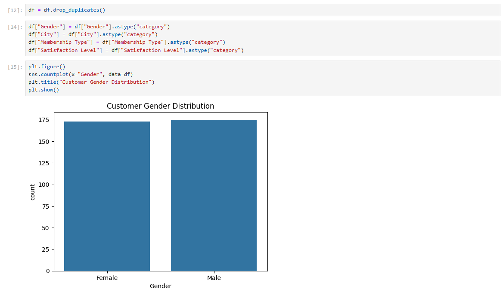
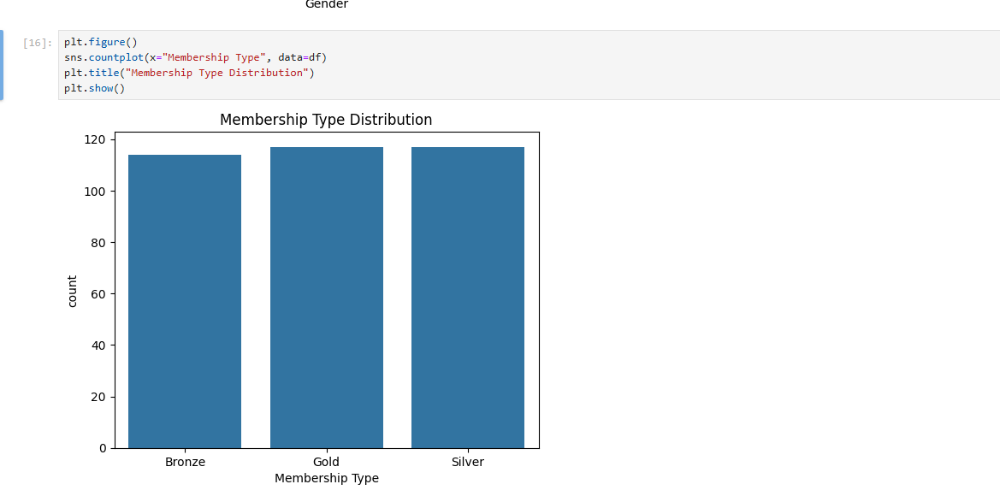
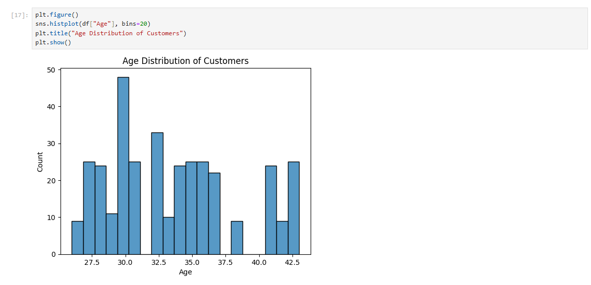
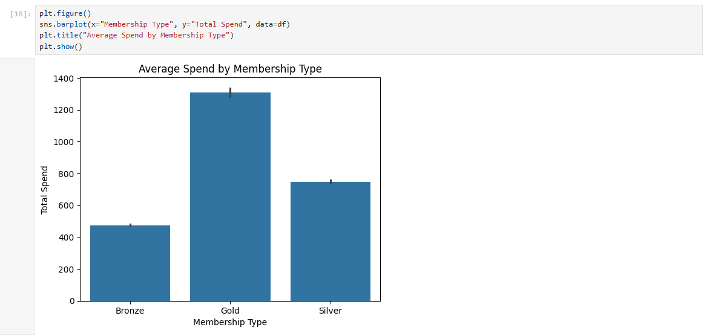
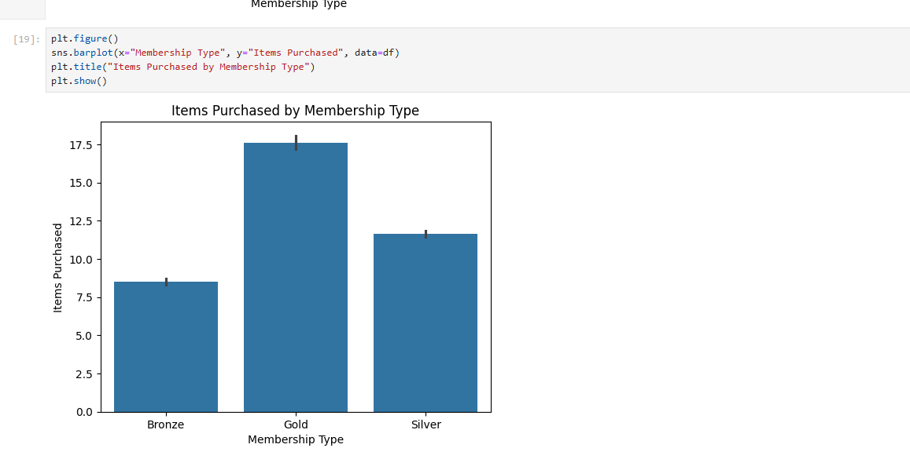
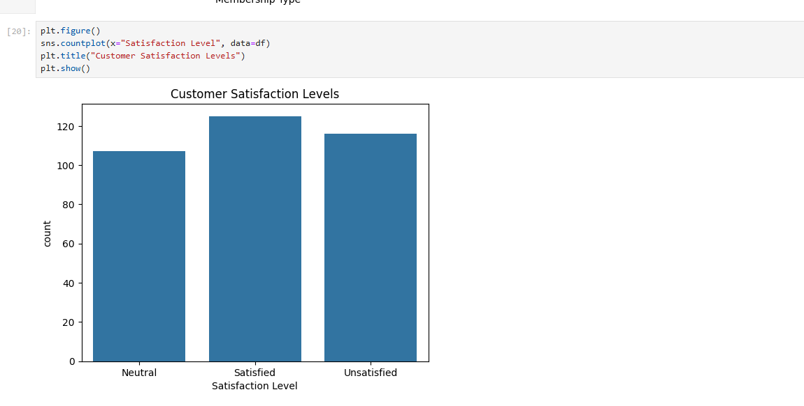
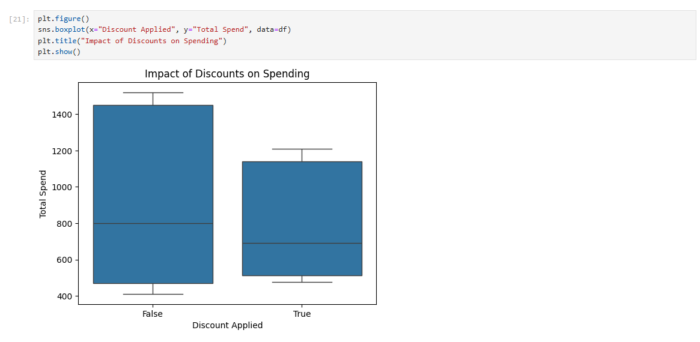
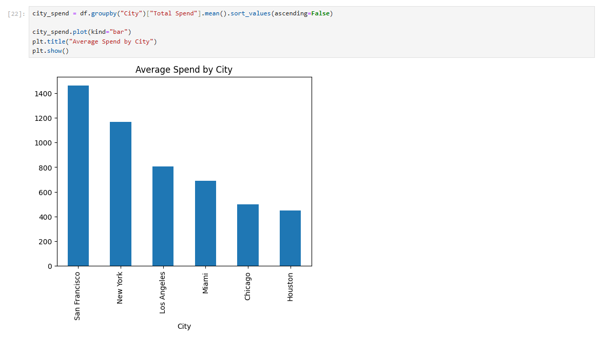
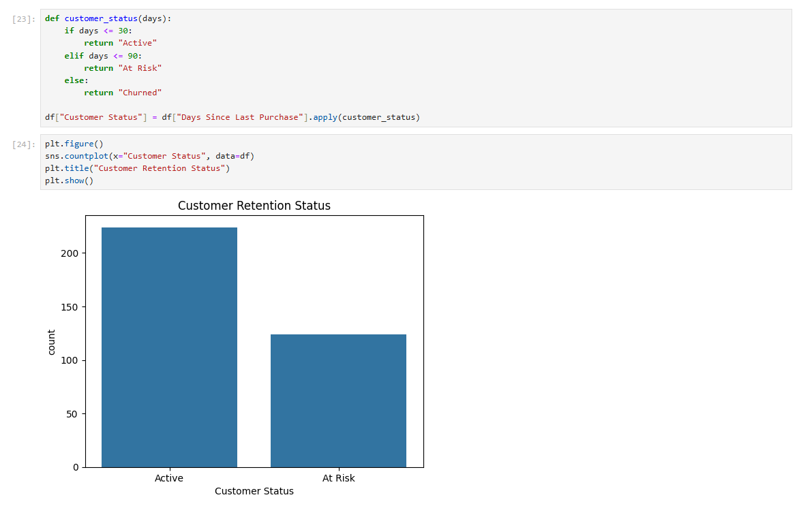
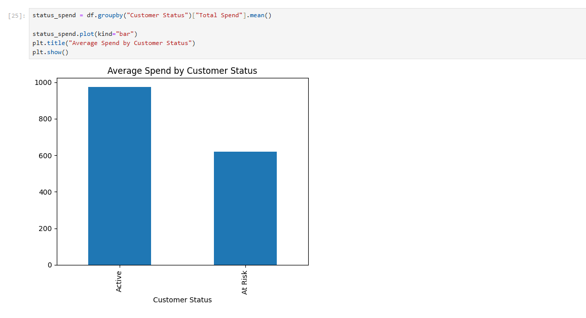

# Customer Behavior Analysis in E-commerce

This project analyzes customer behavior within an e-commerce platform using a dataset that includes demographic information, purchasing activity, customer satisfaction metrics, and engagement indicators.

The goal of this analysis is to identify meaningful patterns in customer behavior, segment customers based on key attributes, and develop actionable retention strategies that can improve customer engagement and business performance.

Through data exploration, visualization, and behavioral analysis, this project demonstrates how businesses can leverage data-driven insights to optimize marketing efforts, improve customer satisfaction, and reduce churn.

---

# Project Objectives

The primary objectives of this project are:

- Explore and understand the structure of the customer dataset
- Perform data cleaning and preprocessing to ensure data quality
- Segment customers based on demographics and membership types
- Analyze spending behavior and purchasing patterns
- Evaluate customer satisfaction levels across segments
- Identify churn risks based on customer inactivity
- Develop targeted retention strategies for different customer groups

---

# Dataset Overview

The dataset contains information about customers interacting with an e-commerce platform. Each row represents a unique customer and includes demographic details, purchasing behavior, and engagement metrics.

## Dataset Features

| Column | Description |
|------|------|
| Customer ID | Unique identifier for each customer |
| Gender | Customer gender (Male, Female) |
| Age | Age of the customer |
| City | Customer's city of residence |
| Membership Type | Membership tier (Gold, Silver, Bronze) |
| Total Spend | Total amount spent by the customer |
| Items Purchased | Total number of items purchased |
| Average Rating | Average rating given by the customer |
| Discount Applied | Indicates whether a discount was used |
| Days Since Last Purchase | Number of days since the customer's last purchase |
| Satisfaction Level | Customer satisfaction category |

---

# Project Workflow

The analysis follows a structured data analytics workflow.

## 1. Data Exploration

- Load the dataset
- Inspect structure and data types
- Generate descriptive statistics
- Identify missing values and duplicates

## 2. Data Cleaning and Preparation

- Handle missing values
- Remove duplicate records
- Convert categorical variables into appropriate formats

## 3. Exploratory Data Analysis (EDA)

- Analyze customer demographics
- Examine spending patterns
- Evaluate purchasing frequency
- Study customer satisfaction trends

## 4. Customer Segmentation

Customers are segmented based on:

- Gender
- Age groups
- Membership type
- Geographic location (city)

Segment analysis includes:

- Average spending
- Number of items purchased
- Satisfaction levels

## 5. Churn Risk Analysis

Customer churn risk is analyzed using **Days Since Last Purchase**.

Customers are categorized into:

| Category | Description |
|------|------|
| Active | Purchased within last 30 days |
| At Risk | No purchase for 30–90 days |
| Churned | No purchase for more than 90 days |

## 6. Retention Strategy Development

Based on the analysis, targeted retention strategies are proposed for each customer segment.

---

# Data Visualization

The analysis includes several visualizations to better understand customer behavior:

- Gender distribution of customers  
- Membership type distribution  
- Age distribution of users  
- Spending patterns by membership type  
- Items purchased across customer segments  
- Customer satisfaction levels  
- Geographic revenue distribution  
- Impact of discounts on purchasing behavior  
- Customer retention status distribution  

These visualizations help reveal patterns that may not be obvious from raw data.

---

# Key Insights

Some important insights derived from the analysis include:

- Premium membership customers tend to spend significantly more than lower-tier members.
- Discounts influence purchasing behavior and can increase the number of items purchased.
- Certain geographic regions contribute more revenue compared to others.
- A portion of customers falls into the **At-Risk** category and requires engagement strategies.
- Customer satisfaction levels provide insight into overall user experience and product perception.

---

# Retention Strategies

Based on the analysis, several retention strategies are proposed.

## Active Customers

- Loyalty reward programs  
- Early access to promotions  
- Personalized recommendations  

## At-Risk Customers

- Targeted discount campaigns  
- Email re-engagement campaigns  
- Personalized product suggestions  

## Churned Customers

- Win-back promotions  
- Limited-time offers  
- Feedback surveys to understand dissatisfaction  

---

# Technologies Used

This project was implemented using the following tools and technologies:

- Python
- Pandas
- NumPy
- Matplotlib
- Seaborn
- Jupyter Notebook

These tools were used for data manipulation, statistical analysis, and visualization.

---

# Project Structure

Example repository structure:

```
Flipshop-Task
│
├── SampleDataSheet.csv
│
├── .ipynb_checkpoints
│   └── Task-checkpoint.ipynb
│
├── images
│   └── AgeDistribution.png
│   └── AverageSpendCustomerStatus.png
│   └── AverageSpendbyCity.png
│   └── AvgSpendByMemberType.png
│   └── CustomerRetentionStatus.png
│   └── CustomerSatisfactionDistribution.png
│   └── DiscountImpactSpending.png
│   └── GenderDistribution.png
│   └── ItemsPurchasedbyMembership.png
│   └── MembershipTypeDistribution.png
│
└── README.md
```

---

# How to Run the Project

### 1. Clone the repository

```
git clone https://github.com/ishubtripathi/Flipshop-Task.git
```

### 2. Navigate to the project directory

```
cd Flipshop-Task
```

### 3. Run the Jupyter Notebook

```
jupyter notebook
```

---

# Author

**Shubhrant Tripathi**

# Visualization Results

Below are some key visualizations generated during the analysis.

---

## Gender Distribution



This chart shows the distribution of customers by gender, helping understand the demographic balance of the platform.

---

## Membership Type Distribution



This visualization highlights the number of customers across different membership tiers.

---

## Age Distribution of Customers



The age distribution provides insight into the primary age groups using the platform.

---

## Average Spend by Membership Type



Higher membership tiers generally show higher average spending behavior.

---

## Items Purchased by Membership Type



This chart compares purchasing frequency across membership categories.

---

## Customer Satisfaction Distribution



Customer satisfaction levels help evaluate the overall experience of users on the platform.

---

## Impact of Discounts on Spending



This visualization shows how discounts influence the total spending behavior of customers.

---

## Average Spend by City



This chart identifies geographic regions contributing the most revenue.

---

## Customer Retention Status



Customers are categorized based on the number of days since their last purchase.

---

## Average Spend by Customer Status



This visualization helps determine if high-value customers are at risk of churn.